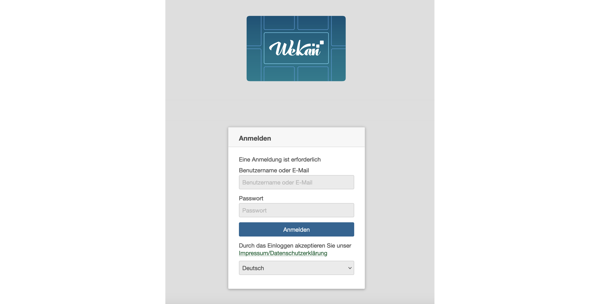

# Willkommen

**Willkommen zu unserer WeKan-Selbstlernlektion!**

In dieser Lektion werden wir uns zunächst kurz mit den Grundlagen von Kanban als Projektmanagementmethode befassen. Anschließend lernen wir, wie diese beispielhaft mit der Software WeKan umgesetzt werden kann. Dabei lernen wir auch den grundlegenden Funktionsumfang von WeKan kennen.

**Klicken Sie nun mit dem Symbol > weiter zur ersten Lektion.**

# Kapitel 1: Was ist Kanban? (1/2)

*Kanban* ist eine (agile) Methode, die darauf abzielt, den Fortschritt visuell darzustellen. Dabei werden Aufgaben als Karten auf einem Kanban-Board dargestellt und in Spalten organisiert, um den Status der Aufgaben zu kennzeichnen. Dies kann bei Studierenden auch für die Organisation von Studienprojekten, Lernaufgaben oder Prüfungsvorbereitungen genutzt werden. Dabei können die Boards auch von mehreren Nutzenden gleichzeitig gesehen und bearbeitet werden.

# Kapitel 1: Was ist Kanban? (2/2)

**Quizfrage 1:** Was kann die Kanban-Methode im Studienalltag verbessern?

[( )] Die Visualisierung des Fortschritts von Lernaufgaben und Projekten.
[( )] Die effiziente Zusammenarbeit mit Kommiliton*innen.
[( )] Die Visualisierung des Fortschritts von Lernaufgaben und Projekten.
[(X)] Alle oben genannten.
**********************************
Gut gemacht!
**********************************

# Kapitel 2: Was bietet WeKan? (1/2)

Bei WeKan handelt es handelt sich um eine Server-basierte Webanwendung, die frei von [dieser Seite](wekan.github.io/#install) heruntergeladen werden kann. (Achtung: Für die Installation und den Betrieb sind Administratorkenntnisse erforderlich.)

**Wenn Sie Mitglied der Universität Hildesheim sind**, können Sie WeKan ohne Installation direkt nutzen, solange Sie sich innerhalb des Netzwerks der Universität befinden (vor Ort oder über VPN). Über die [WeKan UniWiki-Seite](www.uni-hildesheim.de/wiki/digitalcampus/organisation/wekan) finden Sie den Link sowie die Anleitung zur Software.

WeKan ist bei Weitem nicht nur für die Nutzung eines klassischen Kanbans gedacht. Es können vielfältige Anwendungsfälle abgebildet werden. Grundidee des Tools ist es Elemente (Karten) in Kategorien (Listen) zu organisieren. Sie können z.B. Linklisten erstellen, Ansprechpersonen definieren, Agendas erstellen, die Lehre strukturieren (siehe nachfolgender Screenshot) oder Beschaffungsvorschläge kategorisieren. Der Fantasie sind keine Grenzen gesetzt.

Vor allem die Zusammenarbeit mit anderen wird mit WeKan durch geteilte Boards erheblich vereinfacht. Projekte werden übersichtlicher und der Projektfortschritt ist jederzeit und unkompliziert einsehbar. Aber auch persönliche Boards bringen Struktur in Ihren (Arbeits-)Alltag.

# Kapitel 7: Abschluss und Ressourcen

, Figure 6. Graduation by Hippo px, [CC BY-SA 4.0](https://creativecommons.org/licenses/by-sa/4.0/legalcode)")

**Herzlichen Glückwunsch!**

Sie haben die Selbstlernlektion "WeKan - Eine Einführung" erfolgreich abgeschlossen. In dieser Lektion haben Sie gelernt, wie Kanban und WeKan im Alltag angewendet werden können, um Aufgaben, Projekte und die Zusammenarbeit zu organisieren.

Wenn Sie nun motiviert sind, mit WeKan weiterzuarbeiten, finden Sie [hier im WeKan Uni-Wiki hilfreiche Schritt-für-Schritt-Anleitungen](www.uni-hildesheim.de/wiki/digitalcampus/organisation/wekan/schrittanleitungen).

Auf [dieser Seite](www.uni-hildesheim.de/wiki/digitalcampus/organisation/wekan) finden Sie außerdem den Zugang zum WeKan der Universität Hildesheim, eine Übersicht über Anwendungsbeispiele und ein Support-Kontaktformular für Universitätsangehörige.

**Viel Erfolg bei der Nutzung von Kanban und WeKan!**