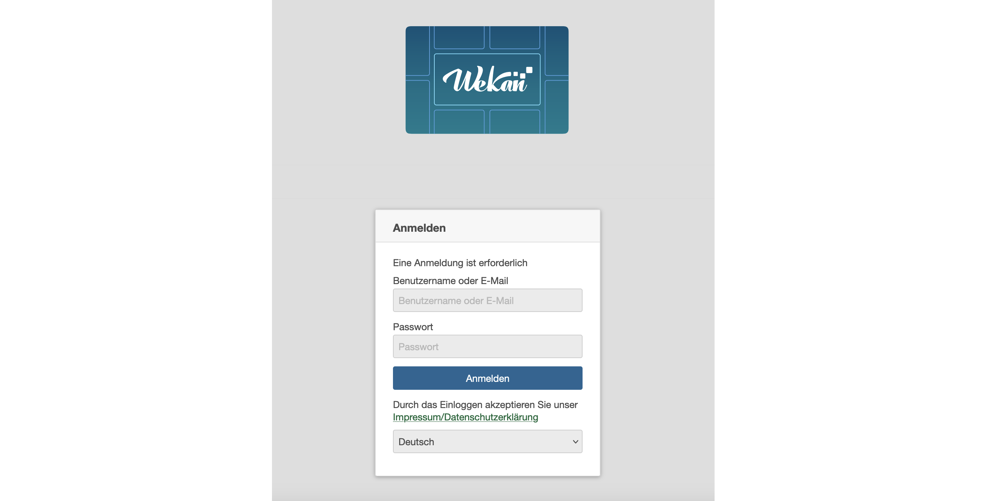
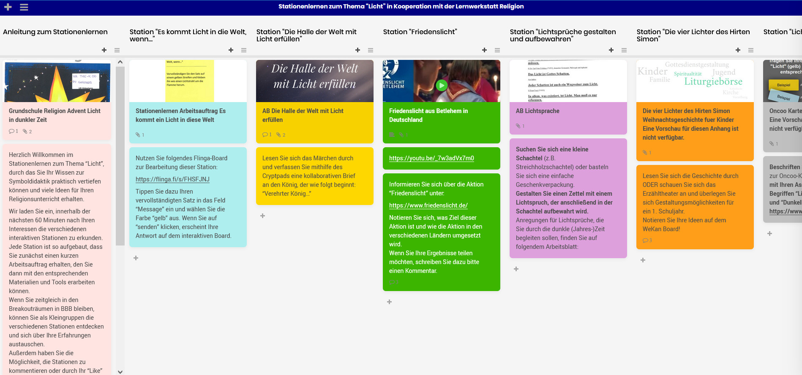

# Lektion 2: Was bietet WeKan? (1/2)

Bei WeKan handelt es handelt sich um eine Server-basierte Webanwendung, die frei von [dieser Seite](wekan.github.io/#install) heruntergeladen werden kann. (Achtung: Für die Installation und den Betrieb sind Administratorkenntnisse erforderlich.)

**Wenn Sie Mitglied der Universität Hildesheim sind**, können Sie WeKan ohne Installation direkt nutzen, solange Sie sich innerhalb des Netzwerks der Universität befinden (vor Ort oder über VPN). Über die [WeKan UniWiki-Seite](www.uni-hildesheim.de/wiki/digitalcampus/organisation/wekan) finden Sie den Link sowie die Anleitung zur Software.

WeKan ist bei Weitem nicht nur für die Nutzung eines klassischen Kanbans gedacht. Es können vielfältige Anwendungsfälle abgebildet werden. Grundidee des Tools ist es Elemente (Karten) in Kategorien (Listen) zu organisieren. Sie können z.B. Linklisten erstellen, Ansprechpersonen definieren, Agendas erstellen, die Lehre strukturieren (siehe nachfolgender Screenshot) oder Beschaffungsvorschläge kategorisieren. Der Fantasie sind keine Grenzen gesetzt.

Vor allem die Zusammenarbeit mit anderen wird mit WeKan durch geteilte Boards erheblich vereinfacht. Projekte werden übersichtlicher und der Projektfortschritt ist jederzeit und unkompliziert einsehbar. Aber auch persönliche Boards bringen Struktur in Ihren (Arbeits-)Alltag.